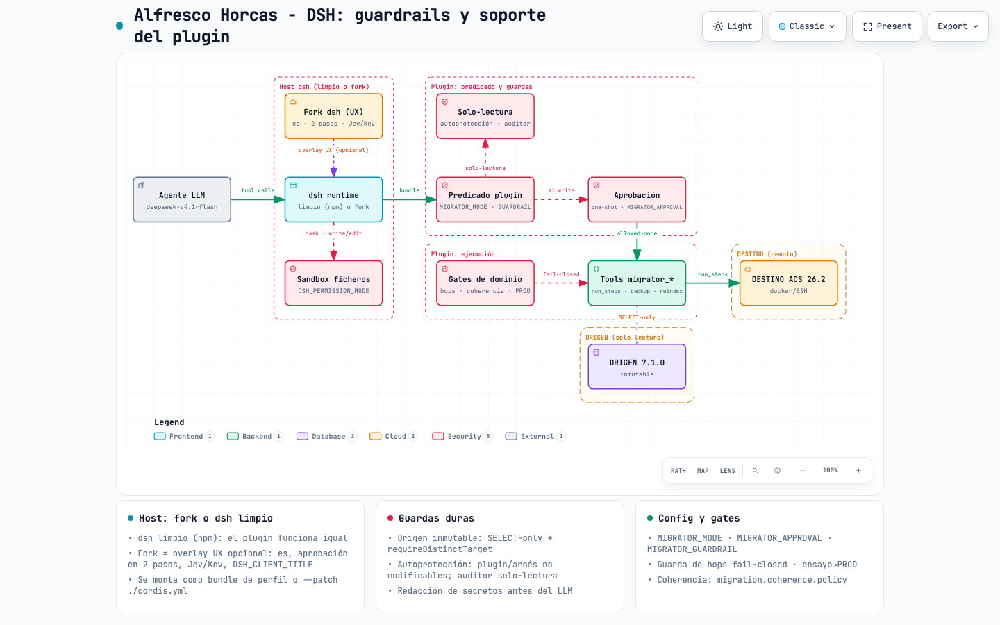

# dsh-plugin-alfresco-migrator

Plugin de [DeepSeek Harness](https://github.com/deepseek-ai/deepseek-harness) (`dsh`) para migraciones de
**Alfresco Content Services**. El arnés aporta el **loop, la memoria de sesión y las herramientas**; este
plugin aporta el **dominio** (rutas de versión, esquemas de referencia, recomendaciones oficiales) y
**encapsula la seguridad** (el origen es inmutable; la escritura solo va al destino y con aprobación).

## Instalación y uso (rápido)
El repo es **privado**: necesitas `gh` autenticado o credenciales git. Clona y ejecuta el instalador:
```sh
gh repo clone horelvis/dsh-alfresco-migrator ~/.local/share/alfresco-dsh-horcas -- --depth 1
~/.local/share/alfresco-dsh-horcas/install.sh
```
O, en un solo paso (bootstrap remoto autenticado con `gh`):
```sh
curl -fsSL -H "Authorization: Bearer $(gh auth token)" \
  https://raw.githubusercontent.com/horelvis/dsh-alfresco-migrator/main/bootstrap.sh | sh
```
O desde el repo ya clonado:
```sh
./install.sh                    # deps + build + bundle en el perfil dsh + comando global `alfresco-dsh-horcas`

cd ~/migraciones/mi-proyecto    # el WORKSPACE: aqui vive el YAML del proyecto (y su .env)
alfresco-dsh-horcas             # abre la UI web (recomendado); crea .env desde .env.example si falta
alfresco-dsh-horcas headless "analiza en solo lectura la migracion de data/projects/example.yaml"
alfresco-dsh-horcas --help      # ayuda completa
```
Se lanza **en el workspace**: si no hay `.env`, el lanzador lo crea desde `.env.example` (rellena origen,
destino y modelo); si no hay YAML de proyecto, el agente lo crea con `migrator_wizard`. Sin instalar, desde el
repo: `./alfresco-dsh-horcas ...`. Requiere `dsh` y Node ≥ 20 (o `npx`). Para usar el **fork** del arnés como
host: `DSH_BIN="node <fork>/apps/cli/lib/bin.js" alfresco-dsh-horcas web` (ver
[Instalación y lanzamiento](#instalación-y-lanzamiento)).
Detalle en [Instalación y lanzamiento](#instalación-y-lanzamiento) y en [dsh y el plugin](#dsh-y-el-plugin-no-duplicar).

## Por qué sobre dsh
Una migración no termina en un día: se necesita memoria entre sesiones, razonamiento iterativo con
herramientas y observabilidad. Eso ya lo ofrece dsh; este plugin solo aporta el **dominio** de la migración
(tools, skills, guardas y datos de Alfresco), sin reimplementar el arnés.

## Herramientas
**Read-only** (permitidas siempre; declaran `timeoutMs`):
- *Assessment y planificación*: `migrator_assess` (inventario del origen: REST + JDBC + content store),
  `migrator_source_stack` (despliegue del origen: servicios, AMPs/JARs/config), `migrator_upgrade_path` (ruta
  soportada + gates), `migrator_strategy` (C1–C5/D1–D2/I1–I2), `migrator_estimate` (ventana por fases, cuello,
  riesgos y política de reindex), `migrator_checklist` (pre/post-cutover según versión/edición/motor),
  `migrator_recommendations` (recomendaciones oficiales por código de hallazgo), `migrator_jira_export`.
- *Preflight y coherencia*: `migrator_schema_versions`, `migrator_schema_check` (PK/UNIQUE vs referencia),
  `migrator_coherence` (refs/dangling/orphans/sizeMismatch), `migrator_dangling_explain` (nodo/tipo/ruta de cada
  colgante), `migrator_mount_check` (NAS/SAN: mismo backing store), `migrator_distinct_check` (destino ≠ origen).
- *Destino y paridad*: `migrator_target_state` (estado real del destino: contenedores, datos, versión),
  `migrator_verify_target` (paridad origen→destino: nodos/refs y ficheros/bytes), `migrator_run_status`,
  `migrator_steps_list`.
- *Ensayo, auditoría y documento*: `migrator_rehearsal_record`, `migrator_experience_latest`,
  `migrator_environment_parity` (drift vs ensayo; BLOCKER impide PROD), `migrator_audit` (auditoría determinista
  del ensayo), `migrator_review` (reviewer LLM, ante duda ABSTAIN), `migrator_report` (documento de migración).
- *Continuidad y ayuda*: `migrator_resume` ("dónde estamos"), `migrator_journal` (hitos), `migrator_lessons` /
  `migrator_lesson_add` (lecciones compartidas entre proyectos), `migrator_help`, `migrator_validate` (YAML vs schema).

**Escritura** (denegadas en `MIGRATOR_MODE=readonly`; con `write` requieren **aprobación humana**; solo destino o
fichero de trabajo, nunca el origen):
- `migrator_run_steps` — ejecuta la composición de pasos que decide el agente (dry-run por defecto; `resume`).
- `migrator_target` — prepara el destino (dry-run o ejecución).
- `migrator_provision` — provisiona el destino por hop en Docker Compose.
- `migrator_backup` — backup no destructivo del origen (dump + content store + manifiesto SHA-256 + config).
- `migrator_copy_content` — copia el content store origen → destino.
- `migrator_reindex` — regenera el índice del destino.
- `migrator_wizard` — genera y valida el YAML del proyecto en el workspace.

## Pasos de migración (el agente compone, no un pipeline fijo)
`preflight-target`, `provision-hop`, `backup-source-db`, `copy-content`, `restore-target-db`, `schema-upgrade`, `smoke-boot`, `reindex`,
`verify-target`. Cada paso es idempotente, se registra en `.migrator/checkpoints.jsonl` y respeta los
overrides `MIGRATOR_DB_DUMP_CMD`/`RESTORE_CMD`/`REINDEX_CMD`/`MIGRATOR_DST_PROVISION`.

> **Placeholders con rutas**: el plugin sustituye `{out}`/`{in}` **sin comillas** y ejecuta con `sh -c`. Si el
> workspace está en una ruta con espacios, cítalos en el override (`> "{out}"`) o lanza desde una ruta sin espacios.

**Stack por versión.** Los hops intermedios son repositorio + infra; `target.stack` (Share, transform, proxy,
extensiones) se aplica **solo en la versión final**. Para otra combinación, `target.stackByVersion`
(clave `mayor.menor`, p.ej. `"26.2": { share: true }`; `{}` = solo repositorio + infra) manda sobre `stack` en ese hop.

**Índice en 26.x CE (Search Community).** Solr desaparece en 26.x. El stack final generado incluye el
`batch-indexer` (`alfresco-elasticsearch-batch-indexing`) y activa el subsistema `elasticsearch` del repositorio.
El indexador **no indexa el histórico por sí solo**: el paso `reindex` (solo en la versión final) **siembra el
cursor** en el primer commit de la BD y valida el *prefix-map* de los modelos propios. Detalle:
[`docs/reindex-elastic-26x.md`](docs/reindex-elastic-26x.md).

### Upgrade físico por hop
En una ruta multi-hop el DESTINO se sube **versión a versión**, reutilizando el mismo content store y la
misma BBDD copiados a un **directorio de versión**, y dejando que ACS aplique el **auto-update de esquema**
al arrancar. Incluye la migración de **versión mayor de PostgreSQL** (`pg_restore` lógico, `pg_upgrade` o
`pgautoupgrade`). Procedimiento completo y mapeo con las tools:
[`docs/upgrade-por-hop.md`](docs/upgrade-por-hop.md).

## Flujo ensayo → producción
Una migración nunca se ejecuta directo en PROD: primero se ensaya en un **clon de producción o TEST**.
El ensayo es una **campaña con varios intentos**: ejecutas en PRE, falla un paso, restauras y **reanudas
desde ese punto** (`resumeFrom`); cada intento queda registrado.

1. `stage: clone|test` → ejecutar los pasos (`migrator_run_steps`) y registrar cada intento con
   `migrator_rehearsal_record` (outcome `ok|failed|aborted`, paso fallido y punto de reanudación).
   La campaña guarda el *fingerprint* del origen: versión, esquema PK/UNIQUE, replicación, nodos, tamaño.
2. `stage: prod` → `migrator_target --execute` / `migrator_run_steps` comprueban `migrator_environment_parity`:
   - sin ensayo validado → **bloquea**;
   - drift `BLOCKER` (versión distinta, esquema con defecto, CDC activo) → **bloquea**;
   - drift `WARN` (nodos/tamaño > 10%) → avisa.

La experiencia se guarda en `.migrator/experience.jsonl` (una campaña por proyecto+stage, con su historial
de intentos); complementa la memoria conversacional del arnés y permite reanudar sin repetir lo ya hecho.

## Guardrails de seguridad (todos)
La seguridad **no depende del prompt**: está impuesta en código determinista.



Versión interactiva (zoom, búsqueda, trazado de relaciones): [`docs/harness-guardrails.html`](docs/harness-guardrails.html)
(fuente: [`docs/harness-guardrails.architecture.json`](docs/harness-guardrails.architecture.json), generada con
[archify](https://github.com/tt-a1i/archify)). El plugin se monta igual sobre **dsh limpio** (npm) o sobre el
**fork**; el fork solo añade UX (español, aprobación en 2 pasos con motivo estructurado, decision-consultant
Jev/Kev, título de producto) y no es requisito funcional.

Resumen, por mecanismo:

| # | Guardrail | Qué impone | Dónde | Config |
|---|---|---|---|---|
| 1 | **Origen inmutable** | El ORIGEN nunca se escribe | `infra/pg.ts` (SELECT-only), `security/policy.ts` (`guardReason`), `domain/guards.ts` (`requireDistinctTarget`) | — |
| 2 | **Solo-lectura por defecto** | Las tools de **escritura** del migrador se **deniegan** | `security/policy.ts` (`readOnly`) | `MIGRATOR_MODE=readonly\|write` |
| 3 | **Aprobación one-shot** | Escrituras (en `write`) requieren aprobación; fail-closed | `approval.ts` (`approval/request`) | `MIGRATOR_APPROVAL` |
| 4 | **Guardrail solo-migración** | Tools ajenas por capacidad: lectura, shell/ficheros (gobernados por el sandbox) y orquestación sí; web y tools desconocidas no | `security/policy.ts` (`GUARDRAIL_ALLOW`) | `MIGRATOR_GUARDRAIL`, `MIGRATOR_GUARDRAIL_ALLOW` |
| 5 | **Rutas de versión estrictas** | Rechaza saltos `UNSUPPORTED`; avisa hops intermedios y `REQUIRES_VALIDATION` | `domain/upgrade-paths.ts` | — |
| 6 | **Guardas de almacenamiento (NAS/SAN)** | Mismo backing store → BLOCKER (aborta la copia); no demostrable → confirmación humana | `domain/mounts.ts`, `steps.ts` | `MIGRATOR_SKIP_MOUNT_GUARD` |
| 7 | **Ensayo → PROD** | PROD exige ensayo validado; drift `BLOCKER` bloquea | `tools/write.ts`, `tools/execution.ts`, `domain/experience.ts` | — |
| 8 | **Política de coherencia** | `FAIL_ON_DANGLING` bloquea; `WARN`/`REPAIR` no | `tools/coherence.ts`, `domain/coherence.ts` | `migration.coherence.policy` |
| 9 | **Reviewer LLM** | Anonimización reversible; ante duda **ABSTAIN** (nunca aprueba solo) | `domain/reviewer.ts`, `domain/privacy.ts` | `MIGRATOR_AI_ANONYMIZATION` |
| 10 | **Secretos** | Compose sin secretos embebidos; `.env` ignorado por git; **la salida de TODAS las tools (incl. `bash`/`read`) se redacta antes del LLM** (valores de `stack.env`/entorno + patrones `password=`, `user:pass@`) | `domain/provision.ts`, `security/redact.ts`, `.gitignore` | — |
| 11 | **Recuperación tras interrupción** | Nunca reintentar a ciegas un paso con efectos: verificar estado y `resume` | `domain/checkpoints.ts`, `tools/execution.ts` | `migrator_run_status`, `resume` |
| 12 | **Guarda de hops** | Ruta multi-hop: no se ejecuta si el DESTINO no está en la versión del hop que toca (verificado por REST, fail-closed); con `provision-hop` primero, lo verifica `smoke-boot` después | `domain/hops.ts`, `tools/execution.ts` | `MIGRATOR_DST_BASE_URL` |
| 13 | **Sandbox de ficheros** | Toda escritura/borrado por shell o tools de ficheros escala a **aprobación humana** | arnés (`DSH_PERMISSION_MODE`), lanzador | `DSH_PERMISSION_MODE=read-only` |
| 14 | **Autoprotección** | El agente no puede modificar, compilar ni versionar el plugin ni el arnés (solo leerlos) | `security/policy.ts` (`PROTECTED_DIRS`, `selfModificationReason`) | — |
| 15 | **Auditoría en 3 niveles** | `migrator_audit` (hechos) + revisor de **solo lectura forzada** + **puerta del arnés**: sin auditoría 0 FAIL y posterior al último paso, se **deniega** el informe final y el reindex final | `domain/audit.ts`, `security/policy.ts` (auditor), `harness/auditor-gate.mjs` | `MIGRATOR_AUDITOR_NAME` |
| 16 | **Reindex solo en la versión final** | Nunca se reindexa en hops intermedios; en la final es obligatorio (sin mecanismo → bloqueo, no un OK falso) | `domain/steps.ts` (`reindex`) | `MIGRATOR_REINDEX_CMD` |

### 1. Origen inmutable
- Todo acceso a PostgreSQL pasa por `selectOnly()` (solo `SELECT`/`WITH`).
- Guard monotónico (`ctx.tools.guard`): bloquea cualquier tool de escritura que nombre el origen.
- `requireDistinctTarget`: si destino y origen comparten **BD** o **content store** → `BLOCKER` (se aborta).

### 2. Solo-lectura por defecto (`MIGRATOR_MODE`)
Por defecto `readonly`: `migrator_target`, `migrator_run_steps`, `migrator_backup`, `migrator_reindex`,
`migrator_provision`, `migrator_copy_content` y `migrator_wizard` devuelven **`deny`** (aunque el modelo
insista). Para el ensayo/cutover real: `MIGRATOR_MODE=write` (y entonces aplica la aprobación del punto 3).

### 3. Aprobación real (`approval/request`)
Answerer configurable por `MIGRATOR_APPROVAL` (solo relevante con `MIGRATOR_MODE=write`):
- `deny` (defecto) — rechaza toda escritura (fail-closed);
- `allowlist` — permite solo las tools de `MIGRATOR_APPROVAL_ALLOW` (coma-separadas);
- `interactive` — pregunta por stdin si hay TTY; sin TTY (perfil web) delega en la UI del arnés;
- `allow` — concede todo (solo entornos de confianza/CI).

Solo concesiones **one-shot** (vocabulario cerrado `allowed-once | rejected | cancelled | unavailable`;
no existe "permitir siempre"): lo garantiza `assertOneShot` y cada decisión se audita en
`.migrator/approvals.jsonl`. Sin answerer el arnés falla en cerrado.

**Sin autorizaciones heredadas (con matices).** `allowed-once` está atado a la llamada, así que en
`interactive`/`web` un subagente **no** se bloquea. En cambio `allowlist`/`allow` aprueban un **nombre de
tool**, y un subagente heredaría esa concesión amplia: por eso ahí se rechazan las tools de **escritura**
del migrador pedidas por agentes delegados (`parentAgent`/`meta.origin='subagent'`/`delegationDepth>0`).
Las read-only nunca se bloquean.

### 4. Guardrail solo-migración (`MIGRATOR_GUARDRAIL`)
Activo por defecto. Las tools **ajenas** al plugin se deciden por **capacidad**:
- **Permitidas**: lectura/inspección (`read`, `read_image`, `glob`, `grep`); shell y ficheros (`bash`, `pwsh`,
  `write`, `edit`, `str_replace_editor`), **gobernados por el sandbox** `read-only` del arnés (toda escritura o
  borrado pide aprobación, guardrail 13) y por la autoprotección (14); orquestación/multiagente (`subagent`,
  `send_message`, `interrupt_agent`, `list_subagent_models`, `todo_write`, `skill`, `present`,
  `job_list`/`job_output`/`job_kill`, `create_goal`/`get_goal`/`update_goal`); preguntas al humano
  (`ask_user_question`) y contexto de chats previos (`session_search`, `session_event_*`, `session_trace`).
- **Denegadas**: red arbitraria (`web_fetch`, `web_search`) y cualquier tool desconocida.

Aunque el shell esté permitido, **el destino no se opera por `bash`/`ssh`**: todo cambio va por
`migrator_run_steps` (regla del playbook), y el estado se consulta con `migrator_target_state`.

Ampliable con `MIGRATOR_GUARDRAIL_ALLOW=bash,read`; desactivable con `MIGRATOR_GUARDRAIL=false`.

### 5. Rutas de versión estrictas
`requireSupportedUpgradePath(from, to)` **lanza** si no hay ruta o si algún hop es `UNSUPPORTED` (nunca se
salta de versión); `upgradePathWarnings` avisa de los saltos intermedios obligatorios (y de
`REQUIRES_VALIDATION`, clase que la matriz actual ya no usa: 7.1 → 7.4 → 25.3 → 26.2 es todo `SUPPORTED`). Se aplica en `migrator_target`, `migrator_run_steps` y `migrator_provision`.

### 6. Guardas de almacenamiento (NAS/SAN)
`migrator_mount_check` y `copy-content` detectan mismo *backing store* (mismo export NFS/CIFS o mismo
LUN): **BLOCKER** y la copia **aborta**. Lo que no es demostrable desde el guest (discos virtuales/SAN)
se marca `requiresHumanConfirmation=true` y el agente **pregunta** (`ask_user_question`), no lo inventa.

### 7. Ensayo → PROD
`stage: prod` exige un **ensayo (clone/TEST) validado**; el drift respecto al ensayo con severidad
`BLOCKER` (versión distinta, esquema con defecto, CDC activo) **bloquea** la ejecución.

### 8. Política de coherencia
`migration.coherence.policy`: `FAIL_ON_DANGLING` (default) marca `blocked=true` con colgantes;
`WARN`/`REPAIR` permiten continuar dejándolo documentado.

### 9. Reviewer LLM
Los artefactos hacia el LLM se **anonimizan** de forma reversible (el mapeo nunca sale del host) y, si el
LLM falla o responde algo no parseable, el veredicto es **`ABSTAIN`** (nunca un "apruebo" implícito).

### 10. Secretos
El compose generado no embebe secretos (variables de entorno); `.env` está en `.gitignore`.

**Compose propio del operador**: si el YAML define `target.composeFile` (ruta **en el host destino**, otra
máquina), el migrator **usa ese compose tal cual** (`docker compose -f <fichero>`) y **no genera ni escribe
ninguno**: valida, para su stack y levanta solo la infraestructura (`postgres activemq search`); Alfresco se
arranca tras el restore (`schema-upgrade`). Se respeta el nombre de proyecto del propio compose (sin `-p`),
así que nunca renombra ni toca tu despliegue. Servicios esperados: `postgres`/`activemq`/`search` y `alfresco`.
Con `composeFile`, `provision-hop` **falla en cerrado** (el migrator no cambia la versión de tu compose); los
secretos del stack se **fusionan** en el `.env` junto a tu compose sin pisar lo tuyo.

### 11. Recuperación tras interrupción
Si una llamada a tool se interrumpe (parada del turno, cierre/reinicio del servidor web), el arnés la
marca como *"outcome unknown"* y no cierra el turno. Para nuestras tools:
- **Read-only** (`migrator_coherence`, `migrator_assess`, `migrator_verify_target`…): reintentar es seguro.
- **Escritura/idempotentes** (`migrator_run_steps`, `copy-content`, `restore-target-db`, `reindex`…): **no
  reintentar a ciegas**. Primero `migrator_run_status` (checkpoints) y verificar el estado externo; luego
  continuar con `migrator_run_steps` y `resume=true` (omite los pasos ya `OK` en `.migrator/checkpoints.jsonl`).
- No reiniciar el servidor del perfil `web` con un turno en curso.

Las tools **read-only declaran `timeoutMs`** (15s–5min según coste) para que no cuelguen indefinidamente.
Las de **escritura no lo declaran** a propósito: cancelar un paso con efectos podría dejar un resultado
ambiguo ("outcome unknown"); en su lugar son **idempotentes + checkpointed** y se reanudan con `resume`.

### 12. Guarda de hops (ruta multi-hop)
Con una ruta de varios saltos (`7.1.0 → 7.4 → 25.3 → 26.2`), `migrator_run_steps` **no ejecuta** hasta que
el DESTINO esté en la versión del hop que toca. La versión del destino se **lee** del propio repositorio
(Discovery REST vía `MIGRATOR_DST_BASE_URL`), **no se declara**; si no se puede verificar, **falla en
cerrado**. El progreso por hop se registra en `.migrator/hops.jsonl`, así que no se puede saltar al hop
final sin pasar por los intermedios. Para una ruta de un solo hop la guarda no aplica.
**Excepción**: si la composición empieza por `provision-hop` (que pone el destino en la versión del hop), la
guarda previa no aplica y `smoke-boot` verifica la versión después (fail-closed); el hop solo se registra si el
run termina OK.

### 13. Sandbox de ficheros (`DSH_PERMISSION_MODE`)
El lanzador arranca el arnés con `DSH_PERMISSION_MODE=read-only`: cualquier escritura, borrado o redirección por
shell o tools de ficheros **escala a aprobación humana**. No usar `workspace-write` (borra en el workspace sin
preguntar) ni `danger-full-access` (sin aprobación).

### 14. Autoprotección
El agente puede **leer** el plugin y el arnés, pero nunca modificarlos, compilarlos ni versionarlos (ni por shell
ni por tools de ficheros): lo impone `selfModificationReason` sobre `PROTECTED_DIRS`. Si el fallo es del plugin,
el agente para y avisa al humano.

### 15. Auditoría en 3 niveles
- **Nivel 0** — `migrator_audit`: recalcula desde el estado durable (checkpoints, hops, experiencia, journal,
  evidencia, checklist) y contradice el resumen si no cuadra; se anota en `.migrator/audit.jsonl`.
- **Nivel 1** — revisor independiente con contexto fresco: el prompt empieza por `[[MIGRATOR-AUDITOR]]` (o el
  teammate `auditor`) y el plugin le **fuerza solo lectura** (deniega escrituras del migrador, mutación de
  ficheros y redirecciones de shell).
- **Nivel 2** — puerta del arnés (`harness/auditor-gate.mjs`, montada por `cordis.yml`): deniega
  `migrator_report` y el `reindex` final si no hay una auditoría con **0 FAIL posterior al último checkpoint**.

### 16. Reindex solo en la versión final
El paso `reindex` se **omite** si el destino no está en la versión final. En la final es obligatorio: si no hay
mecanismo (Solr/EE sin `MIGRATOR_REINDEX_CMD`) falla con el bloqueo concreto; en CE 26.x siembra el cursor del
batch indexer (ver `docs/reindex-elastic-26x.md`).

## Datos de dominio (`data/`)
- `schema-references/<ver>/Schema-Reference-ALF.xml` (+ `-ACT.xml`): referencia oficial por versión.
- `upgrade-paths.yaml`: **matriz de rutas de upgrade y gates** (datos, no código).
- `estimation.yaml`: parámetros/umbrales del estimador.
- `strategy.yaml`: umbrales del selector de estrategia.
- `images.yaml`: último **parche exacto** de la imagen del repositorio por versión (los tags genéricos no existen).
- `memory.yaml`: reparto de memoria del stack destino (Alfresco = fracción de la RAM disponible en el host/Docker, con suelo y techo).
- `recommendations.yaml`, `project.schema.json`, `projects/example.yaml`.

> El conocimiento vive en **datos y skills**, no hardcodeado. Cambiar la matriz de upgrade o los
> umbrales no requiere tocar código: se edita el YAML.

## dsh y el plugin (no duplicar)
dsh ya aporta el loop, la memoria de sesión, la aprobación y su UI, los presets de permisos, las skills,
las tools nativas (bash/fs/`ask_user_question`/todo/subagent/web…) y el registro de plugins por perfil. El plugin
solo añade **dominio** y no reimplementa nada de eso:
- Se registra como **bundle** del perfil (`package.json` → `dsh.bundle.patch` → `cordis.yml`) con
  `dsh plugin --profile <n> add <repo>`, o como overlay suelto con `dsh --patch ./cordis.yml`.
- La aprobación es un **answerer** del seam `dsh-user-approval` (que no trae answerer propio); en el perfil
  `web` responde la UI. El plugin solo impone la regla de dominio (las escrituras `migrator_*` requieren aprobación).
- Las skills usan el registro `dsh-skill` (contenido generado desde `data/`); el provider de ficheros de dsh es otra vía.
- `.migrator/*.jsonl` (checkpoints/experiencia) son artefactos de **dominio**, no memoria conversacional del arnés.

## Instalación y lanzamiento
```sh
./install.sh    # deps + build + registra el bundle en el perfil dsh + instala el comando `alfresco-dsh-horcas`
cd <workspace>  # el .env del workspace se crea desde .env.example al primer arranque

alfresco-dsh-horcas "analiza en solo lectura la migracion de data/projects/example.yaml"   # headless
alfresco-dsh-horcas web [--port 8080] [--no-open]                                          # UI en el navegador
./alfresco-dsh-horcas "..."   # tambien funciona sin instalar, desde el repo
```
- `install.sh` deja **`alfresco-dsh-horcas`** como comando global (al estilo `opencode`/`codex`/`claude`):
  `npm link` si puede y, si no, un symlink en `~/.local/bin`.
- **Configuración** (de menor a mayor prioridad): defaults internos → fichero de **defaults globales**
  (`$ALFRESCO_DSH_HORCAS_ENV` o `~/.config/alfresco-dsh-horcas/env`) → **`.env` del workspace** (el directorio
  desde el que se invoca; **no** el del repo; se crea desde `.env.example` si falta) → variables exportadas al
  invocar (mandan siempre). Construye `dist/` si falta, mapea el modelo a `DEEPSEEK_*` y lanza dsh.
- **Host**: `DSH_BIN` (p.ej. el fork: `node <fork>/apps/cli/lib/bin.js`) > `dsh` del PATH > `npx @deepseek-ai/dsh`.
  **`DSH_BIN` no puede ir en el `.env`** (el arnés lo reserva al entorno que lo lanza): expórtalo o ponlo en los
  defaults globales. Si el plugin está instalado en el perfil, lo carga como capa; si no, `--patch ./cordis.yml`.
- Sin argumentos abre la **UI web**; `headless "<tarea>"` es no interactivo. Título de la UI: `DSH_CLIENT_TITLE`
  (defecto "Alfresco Horcas - DSH"). Lanza desde una ruta **sin espacios** si tus overrides usan `{out}`/`{in}` sin citar.
- Aprobación de escrituras: **`interactive`** por defecto en **web** (aprueba en la UI; sin TTY delega
  en ella) y **`deny`** (fail-closed) en headless. También `allowlist`/`allow` (CI).
- **Solo-lectura determinista** por defecto (`MIGRATOR_MODE=readonly`): las tools de **escritura** del
  migrador se **deniegan** en el código (no depende de que el prompt diga "no escribas"). El ensayo/cutover
  real exige habilitarla explícitamente: `MIGRATOR_MODE=write` (+ la aprobación que corresponda).
- **Guardrail solo-migración** por defecto (`MIGRATOR_GUARDRAIL=true`): permite por **capacidad** lectura,
  shell/ficheros (bajo el sandbox `DSH_PERMISSION_MODE=read-only`: toda escritura pide aprobación) y orquestación;
  **deniega** la red arbitraria (`web_*`) y las tools desconocidas. Ampliar: `MIGRATOR_GUARDRAIL_ALLOW=<tool>,...`;
  uso general: `MIGRATOR_GUARDRAIL=false`.
- Requiere `dsh` y Node ≥ 20 (o `npx`). `DSH_PROFILE` cambia el perfil de dsh.
- **El proyecto vive en el workspace**: las tools `migrator_*` resuelven el YAML del workspace
  (`MIGRATOR_PROJECT` o el único `*.yaml` de la carpeta) y las rutas relativas contra el **cwd de la
  sesión**; no hace falta pasar `project`. `migrator_wizard` lo crea en el workspace.

## How-to (desarrollo)

### Añadir una herramienta
1. **Lógica en `src/domain/<x>.ts`**: funciones puras que devuelven **hechos** (no conclusiones), testeables sin
   entorno. El juicio va en las skills (principio de diseño, abajo).
2. **Tool en `src/tools/<x>.ts`** con `defineTool` (`@deepseek-ai/dsh-tools`):
   ```ts
   export function registerXTools(ctx: Context): void {
     ctx.tools.register(defineTool({
       name: 'migrator_x',                 // prefijo obligatorio migrator_
       timeoutMs: 30_000,                  // read-only: SIEMPRE; escritura: NUNCA (idempotente + resume)
       description: 'Qué devuelve y cuándo usarla. Read-only.', // el agente decide por esta descripción
       parameters: { /* JSON Schema de los argumentos */ },
       output: { schema: { type: 'string' }, render: (_a, v) => [{ type: 'text' as const, text: v as string }] },
       async execute(args, exec) { return x(/* ... */); }, // exec: agente/sesion (cwd del workspace)
     }));
   }
   ```
3. **Registrarla** en `src/index.ts` (`registerXTools(ctx)`).
4. **Clasificarla** en `src/security/policy.ts`: `READ_ONLY_TOOLS` o `WRITE_TOOLS`. Una `migrator_*` sin clasificar
   se **deniega** ("Tool desconocida del migrador") y `test/tool-registry.test.ts` falla.
5. **Si escribe**: queda sujeta a `MIGRATOR_MODE`, aprobación one-shot y `guardReason` (origen inmutable). Actúa
   solo sobre el destino o ficheros de trabajo, es idempotente y no expone secretos en su salida (la redacción de
   `security/redact.ts` es la última red, no la primera).
6. **Si es un paso** de `migrator_run_steps`: añade un `StepDefinition` a `STEPS` (`src/domain/steps.ts`) con
   `writes`, `short` (la frase que ve el humano al aprobar) y `run` que devuelva `ok`/`fail`/`skipped`; en
   `dryRun` no toca nada. El runner lo checkpointa y lo hace reanudable.
7. **Contárselo al agente**: cuándo usarla en el playbook (`src/skills.ts`) y en la lista de
   [Herramientas](#herramientas).
8. **Verificar**: test en `test/`, luego `npm run typecheck && npm test && npm run build`.

### Añadir un guardrail
Un guardrail es **código determinista** que no depende del prompt: si no puede demostrar que es seguro, **falla en
cerrado** con un motivo accionable. Elige la capa según lo que necesite saber:

| Capa | Úsala para | Dónde | Efecto |
|---|---|---|---|
| **Política de ejecución** | Decidir por nombre/modo de tool (allow / `ask` / deny) | `decide()` en `src/security/policy.ts` | Deniega o pide aprobación antes de ejecutar |
| **Guard monótono** | Bloquear por los **argumentos** (origen, rutas protegidas, auditor) | `guardReason()` en `src/security/policy.ts` | Motivo de bloqueo; nunca se relaja |
| **Guarda de dominio** | Hechos del entorno (versión del destino, backing store, orden de hops) | `run` del paso en `src/domain/steps.ts` / `src/domain/*.ts` | `fail(...)` del paso con el bloqueo concreto |
| **Puerta del arnés** | Exigir un hito previo leyendo el estado durable (`.migrator/*.jsonl`) | plugin tipo `harness/auditor-gate.mjs`, montado en `cordis.yml` | `tools/pre-execute` con `prepend: true` → `deny` |
| **Salida hacia el LLM** | Que un dato nunca llegue al modelo | `src/security/redact.ts` | Redacta la salida de todas las tools |

Ejemplo (guard monótono que bloquea una tool de escritura por un argumento):
```ts
// src/security/policy.ts, dentro de guardReason(exec)
if (isWrite(exec.name) && /"dropDatabase"\s*:\s*true/.test(JSON.stringify(exec.arguments ?? {}))) {
  return 'Bloqueado: el migrador nunca borra bases de datos del DESTINO; hazlo tú fuera del migrador si procede.';
}
```
Checklist: (1) test de regresión que demuestre el bloqueo y el caso permitido; (2) configurable por entorno **solo**
si hay un caso legítimo, y siempre con el valor seguro por defecto; (3) fila en la tabla de
[Guardrails](#guardrails-de-seguridad-todos) y, si cambia la conducta del agente, regla en el playbook
(`src/skills.ts`); (4) `npm run typecheck && npm test && npm run build`.

## Desarrollo
```sh
npm install
npm run typecheck
npm test          # unitarios (los live se omiten sin entorno)
npm run test:live # tests contra el origen real (requiere MIGRATOR_SRC_DB_*)
                  # el dry-run del pipeline exige MIGRATOR_LIVE_PIPELINE=true (no escribe nada)
npm run build
dsh --profile web --patch ./cordis.yml
```

Variables de entorno del origen: `MIGRATOR_SRC_DB_URL` (o `MIGRATOR_SRC_DB_HOST/PORT/NAME/USER/PASSWORD`),
`MIGRATOR_SRC_VERSION`. `MIGRATOR_DATA_DIR` sobreescribe el directorio `data/`.

Content store: en `contentStore` puedes declarar `path` (ruta del host) o `volume` (volumen Docker);
con `volume`, el plugin resuelve su mountpoint real con `docker volume inspect` en el host correspondiente
y trata `path` como subruta dentro del volumen. El origen (backup/copia) se ejecuta en el host local;
la escritura va al host destino por SSH.

Idioma: el agente responde en **español por defecto** (sección de system prompt configurable con
`MIGRATOR_LANG=es|en|pt|…`), manteniendo intactos los identificadores técnicos.

Avisos proactivos: `migrator_run_steps` avisa si es el **primer intento** (sin experiencia previa) o si
hay un intento previo fallido y conviene `resume=true`.

## Estado
- **Fase 1 (completa)**: tools read-only, seguridad (origen inmutable + aprobación) y datos de dominio.
- **Fase 2 (completa)**: ejecución en destino (provisión, backup, copia, restore, schema-upgrade, reindex)
  vía `migrator_run_steps` con aprobación y guardas, y verificación de paridad (`migrator_verify_target`).
- **Fase 3 (completa)**: ensayo multi-hop guiado por el arnés (`provision-hop`/`smoke-boot` por hop, stack final),
  autoprotección, auditoría en 3 niveles, Search Community en 26.x (batch indexer + sembrado del cursor) y
  stack por versión (`target.stackByVersion`).
- **Ensayo real**: ruta 7.1.0 → 7.4 → 25.3 → 26.2 ejecutada de extremo a extremo. **Pendiente** antes del
  corte: índice completo (cursor sembrado + prefix-map de modelos propios) y paridad sin diferencias.

## Principio de diseño: hechos en el código, juicio en el agente
- **Tools = hechos**: parseo (`/proc/mounts`, `lsblk`, JDBC, hashes), igualdad demostrable, validación de
  schema, SQL read-only. Devuelven datos, no conclusiones.
- **Skills + LLM = juicio**: interpretación (¿es SAN/NAS?, ¿qué estrategia?, ¿es peligroso?, ¿qué falta
  para el corte?). El conocimiento vive en skills (`src/skills.ts`), no hardcodeado.
- **Guardas = código determinista**: origen inmutable, aprobación, y bloqueo **solo cuando es
  demostrable** (mismo export/device de content store).
- Cuando algo **no se puede saber desde el guest** (p.ej. el datastore de un disco virtual), la tool lo
  marca `requiresHumanConfirmation` y el agente **pregunta al humano** (`ask_user_question`) en vez de inventar.
